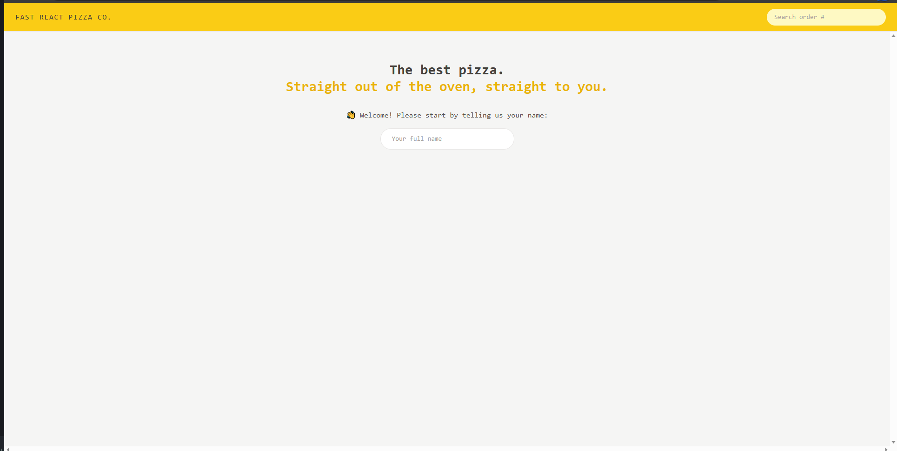
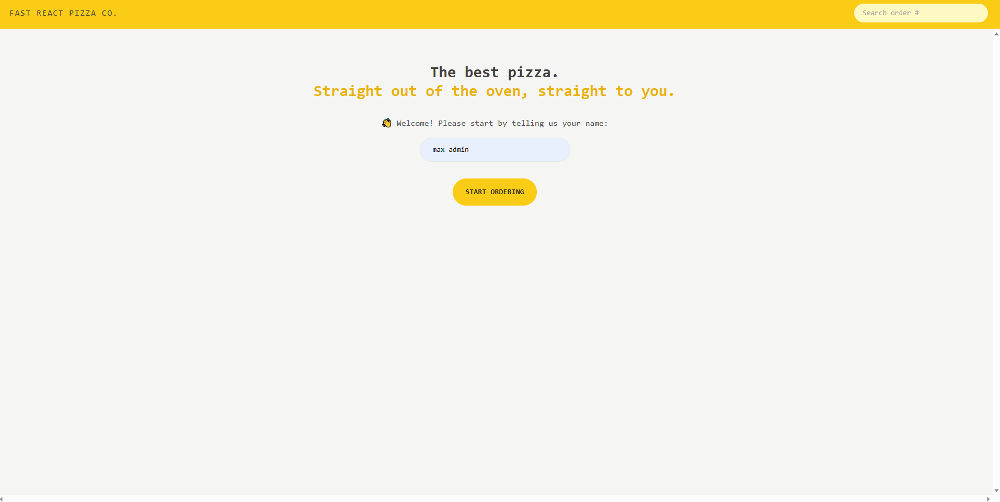
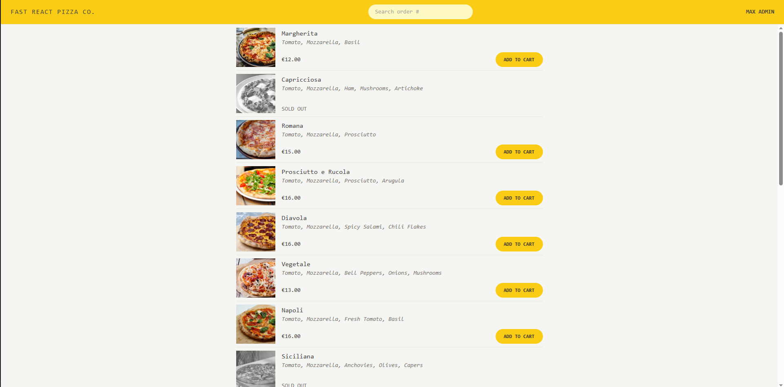
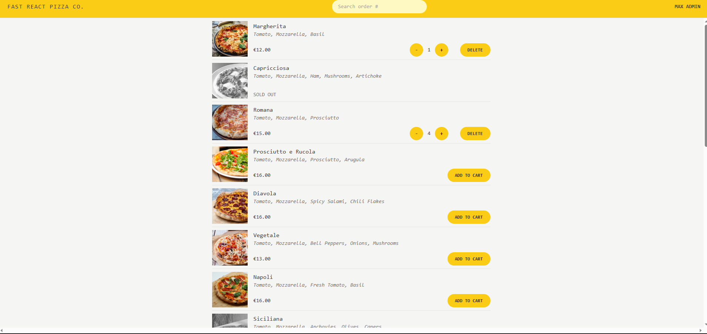
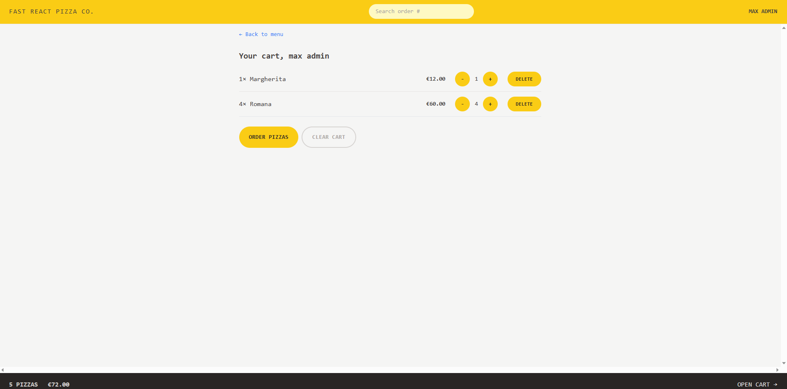
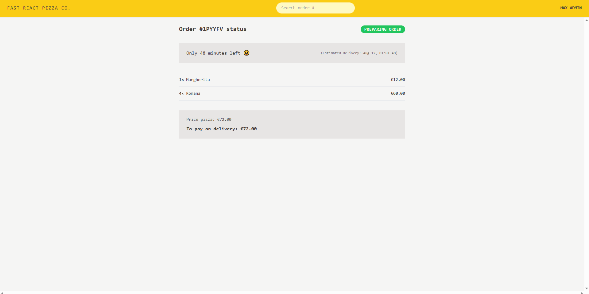
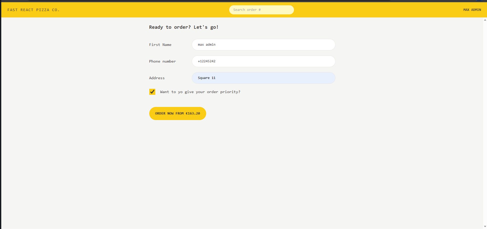

# Pizza-Ordering-App.

The Pizza-Ordering-App is an application that allows users to easily order pizzas and have them delivered to their provided location. Users can select pizzas from a menu, add them to their cart, customize the quantity, and even prioritize their order for faster delivery. The app streamlines the ordering process and provides a seamless user experience.

## Features.

1-Browse a variety of pizzas in the menu.

2-Add pizzas to the cart and adjust quantities.

3-Prioritize orders for faster delivery (with an additional 20% fee).

4-Fill out a form with name, phone, and address for delivery.

5-Review order details, including total price and estimated delivery time.

## Installation.

1-Clone the repository:  
https://github.com/Mohamed-Ramadan1/Pizza-Ordering-App.git

2-install dependencies: npm install

3-Launch the application: npm run dev

## Previw-app-images.

